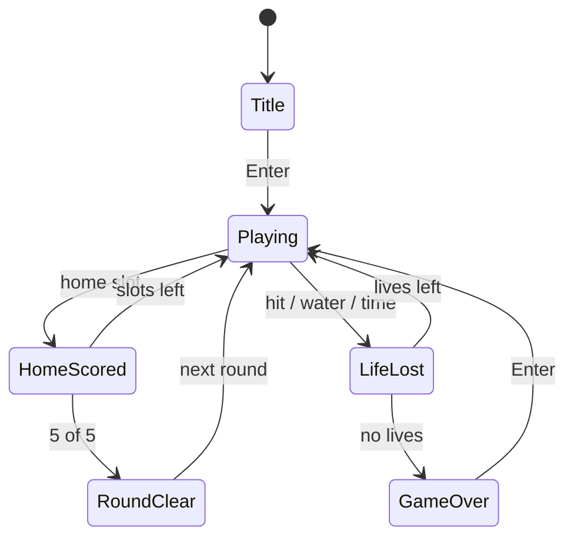
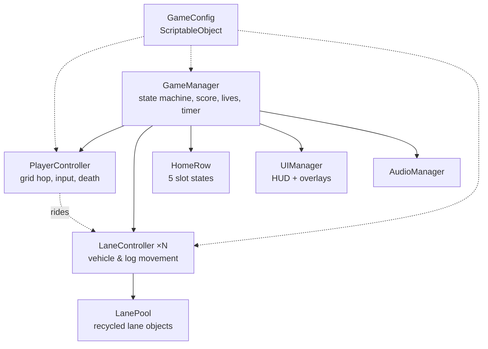

# Game Design Document — *Frogger*

| | |
|---|---|
| **Working title** | Frogger |
| **Team** | Idan Shaul (design, programming, art integration) |
| **Genre** | Arcade / grid-based hazard-crossing / score-chaser |
| **Target platform** | PC (Windows), standalone build |
| **Engine / Unity version** | Unity 6 (6000.3.20f1), URP, 2D |
| **Orientation & reference resolution** | Portrait, 14:16 aspect — 448 × 512 reference (14 × 16 grid of 32 px cells) |
| **Expected session length** | 30 seconds – 3 minutes |
| **Document version** | v0.1 — 2026-09-08 |

---

## 1. High Concept

The player steers a frog to five home slots at the top of the screen. Four discrete hops — up, down,
left, right — cross a road of constant-speed traffic, then a river where the only safe ground is a
drifting log or turtle. Touch a vehicle, touch water, or run the 30-second clock down, and lose one
of three lives.

### Design pillars

1. **Grid-precise hopping** — the frog occupies exactly one cell of a fixed grid at all times; a hop
   is a discrete animated snap from cell to cell, never a continuous slide. This rules out analog
   movement, momentum, and diagonal input: the player's mental model must be "which cell am I moving
   into", not "where am I steering".
2. **The clock is the difficulty** — a 30-second per-life countdown runs from the moment the frog
   spawns and never pauses. Waiting for a perfectly safe gap is always a real cost. This rules out
   safe-camping strategies, and it is why there are no shields, no slow-motion, and no pause during play.
3. **Deterministic, readable hazards** — every lane runs at a constant speed with constant spacing,
   set in the Inspector, identical on every run of a given round. A death is always a misread gap,
   never bad luck. This rules out random spawn timing, random lane speeds, and random hazard placement.

---

## 2. Reference & Inspiration

- **Primary reference:** *Frogger* (Konami / Sega, 1981).
  **Taking:** the two-zone board (road below, river above, safe median between them); five home slots
  at the top; grid-locked single-hop movement; per-life countdown timer; logs and turtle groups as the
  only safe river footing; alternating scroll direction per lane; lives shown as frog icons in the HUD;
  instant restart from the game-over screen.
  **Deferred, not dropped:** turtle **diving** is a committed feature — the finished game has it — but
  it is built immediately after the MVP rather than inside it (see §8.2). The MVP's `Rideable`
  component is designed to accept it without a refactor.
  **Not taking at all:** the snake and otter hazards; the bonus fly; the lady-frog escort — these are
  round-progression content, and this project ships one fixed round layout (see §8.3).
- **Video:** classic *Frogger* arcade gameplay footage — search "Frogger 1981 arcade longplay" for
  30 seconds of the traffic and river timing this project is matching.

---

## 3. Core Game Loop

### Board layout

The whole game is a **14 × 16 grid** of 32 px cells — 448 × 512 reference, the 14:16 Game view aspect.
The grid is the game's unit of everything: one hop is one cell, one lane is one row, sprites are
authored at 32 px and imported at PPU 32, so one cell is exactly 1 world unit.

| Rows (top → bottom) | Contents |
|---|---|
| 1 | HUD strip — score (left), remaining seconds (centre), lives as frog icons (right) |
| 2–3 | Home row — hedge with 5 evenly spaced slots across the 14 columns |
| 4–8 | River — 5 lanes: log, turtles, log, log, turtles (alternating scroll direction) |
| 9 | Median — safe strip; the `GAME OVER` banner is drawn here |
| 10–14 | Road — 5 lanes: truck, car, car, tractor, race car (alternating scroll direction) |
| 15–16 | Start strip — the frog's spawn cell, and where `PRESS ENTER TO PLAY AGAIN` is drawn |

**Moment-to-moment rules** — the things that are true every frame:

- One key press = **exactly one hop of one grid cell**. Holding a direction does nothing after the
  first hop; the key must be released and pressed again. Input arriving during the hop animation is
  buffered for one hop only, so a fast player never loses a press but also never queues a burst.
- A hop takes `hopDuration` seconds of animation, during which the frog is **already considered to be
  in the destination cell** for collision purposes. There is no mid-air state and no partial-cell
  position — this is what makes deaths readable.
- **Road zone:** overlapping any vehicle collider kills the frog instantly. Vehicles never change lane,
  never brake, and wrap around to the opposite side of the screen when they exit.
- **River zone:** the frog dies on contact with open water. It survives only while overlapping a log
  or a turtle, and while overlapping one it **inherits that platform's horizontal velocity** — the frog
  rides. Being carried off either edge of the screen while riding is a death. Adjacent lanes scroll in
  opposite directions, so a hop forward is always a hop onto something moving the other way.
- **The turtles are platforms, not enemies.** Despite reading visually as creatures, a turtle group
  carries the frog exactly as a log does and never kills on contact. The only hazard in the river is
  the water itself — every river death is the frog landing in, or being carried into, open water.
- **Turtles dive** (post-MVP, §8.2) on a fixed cycle per group: `turtleSafeTime` seconds surfaced, then
  a `turtleWarningTime` half-submerged animation during which the frog is **still safe**, then
  `turtleDiveTime` fully submerged, during which that group counts as open water and a frog standing on
  it drowns. The cycle is offset per group so a lane is never entirely underwater at once. The warning
  animation is what keeps this fair under pillar 3: the player is always told before the floor leaves.
- **Home row:** the top row is solid hedge except for five evenly spaced slots. Hopping into an empty
  slot scores and ends the run; hopping into the hedge or into an already-filled slot is a death.
- **Scoring:** +10 the first time the frog reaches each row further forward than any row it has
  reached this life (backward hops and re-crossings score nothing). +50 on filling a home slot, plus
  `remainingSeconds × timeBonusPerSecond`. +1000 for filling all five slots and clearing the round.
- **Failure:** vehicle hit, water contact, carried off-screen, hedge collision, occupied-slot collision,
  or the timer reaching zero. Each costs one life and plays a 0.75 s death animation during which input
  is ignored; then the frog respawns at the start cell with the timer reset to `perLifeTimer`. At zero
  lives the board freezes, `GAME OVER` appears over it, and after a 1.0 s input lockout `PRESS ENTER
  TO PLAY AGAIN` accepts a restart.

### Parameters you will need to tune

| Parameter | What it controls | First guess |
|---|---|---|
| `cellSize` | World distance of one grid cell — the unit everything else is expressed in | 1.0 |
| `hopDuration` | How long the hop animation takes; the practical ceiling on how fast a player can cross | 0.12 s |
| `perLifeTimer` | Seconds allowed per life — the main pressure dial | 30 s |
| `startingLives` | How many mistakes a run tolerates | 3 |
| `laneSpeed[]` | Per-lane speed of vehicles and logs — the main difficulty dial, one value per row | 1.5 – 4.0 |
| `laneSpacing[]` | Gap between consecutive vehicles/logs in a lane; trades directly against `laneSpeed` — changing one always means re-checking the other | 3 – 6 cells |
| `platformLength[]` | Cells per log, or turtles per group — how forgiving a river landing is | 2 – 4 |
| `turtleSafeTime` | Seconds a turtle group stays surfaced and safe | 5 s |
| `turtleWarningTime` | Seconds of half-submerged animation before the dive — still safe, this is the telegraph | 1.5 s |
| `turtleDiveTime` | Seconds fully submerged; the group is open water for this long | 2 s |
| `timeBonusPerSecond` | Points per leftover second when a home slot is filled | 10 |
| `deathAnimDuration` | Input-locked pause after a death, before respawn | 0.75 s |
| `restartLockout` | Input-ignored window on the game-over screen, so a death-frame press does not skip it | 1.0 s |

**Where these live:** a `GameConfig` ScriptableObject asset for the global values (timer, lives,
scoring, hop feel), and per-lane values as `[SerializeField]` arrays on each `LaneController` in the
scene — so a lane can be retimed by dragging a slider with the game running, without a recompile.

**Feel target:** a first-time player fills at least one home slot within three lives; a player who
has had ten minutes with it clears all five slots on a single run.

---

## 4. Controls & Input

| Action | Keyboard / Mouse | Gamepad | Touch |
|---|---|---|---|
| Hop up / down / left / right | Arrow keys, or W / A / S / D | D-pad / left stick (flick, one hop per deflection past 0.5) | — (not supported, see §8.3) |
| Start game / restart after game over | Enter | South button (A) | — |
| Quit to desktop | Esc (from Title and Game Over only) | — | — |

- Input is read on **press** in `Update`, buffered for at most one hop, and applied in `FixedUpdate`,
  so no press is dropped between physics steps and no press survives long enough to feel queued.
- Simultaneous opposite directions in the same frame are ignored entirely; simultaneous perpendicular
  directions resolve to whichever was pressed first, because there are no diagonal hops.
- Gameplay input is dead during the death animation (`deathAnimDuration`) and during the game-over
  lockout (`restartLockout`) — this is what stops the press that killed you from also skipping your
  game-over screen.
- The game has no in-play UI buttons, so there is no case where a click lands on a UI element and a
  hop at the same time.

---

## 5. Screens & UI

The board rows themselves are laid out in §3; this section covers what sits on top of them. The row
budget there doubles as the screen layout — the HUD is row 1, the `GAME OVER` banner is row 9, and the
restart prompt is row 15–16.

1. **Title** — `FROGGER` wordmark, `HI-SCORE` value read from `PlayerPrefs`, and the blinking prompt
   `PRESS ENTER TO PLAY`. The board is visible and animating behind it (traffic and logs already
   moving) so the player can read the timing before committing.
2. **Gameplay** — the board itself: home row with five slots, river zone, safe median, road zone,
   start row. HUD only, no overlays.
3. **Life Lost** — no screen. A death sprite plays on the frog for 0.75 s, one life icon disappears
   from the HUD, and play resumes automatically. Deliberately not a screen, because a modal here would
   break the arcade cadence.
4. **Round Clear** — the five filled slots flash for 1.5 s, a fanfare plays, the slots clear and play
   resumes with `laneSpeed` scaled up for the next round. Score is kept.
5. **Game Over** — the board freezes exactly as it was. `GAME OVER` appears centred on the median
   strip, `PRESS ENTER TO PLAY AGAIN` appears at the bottom. If the run beat the stored high score,
   it is written to `PlayerPrefs` here.

- **HUD during play:** score (top left), remaining seconds (top centre), remaining lives as small frog
  icons (top right), and the five home slots which double as progress. Deliberately absent: a pause
  button, a settings gear, any tutorial prompt, any combo or multiplier readout, and any minimap.
- **Canvas setup:** Screen Space – Camera, CanvasScaler set to *Scale With Screen Size*, reference
  resolution 448 × 512, match = 1 (height), so the board's vertical extent is what stays fixed —
  a wider window adds pillarboxing, never extra board.

### Resolution & scaling

The 14 × 16 grid is the **design** resolution, not the output resolution. The game ships as a
1920 × 1080 window (and fullscreen at the desktop's native resolution); the board is rendered at
448 × 512 and scaled up to fit the window's *height*, centred, with the leftover width filled by a
black pillarbox. Nothing about the board changes with window size — a wider monitor never reveals more
lanes, because more visible road would be a gameplay change, not a display change.

Scaling is handled by the **Pixel Perfect Camera** component (URP 2D) with reference resolution
448 × 512, PPU 32, *Upscale Render Texture* on, so the upscale is always an integer multiple
(×2 at 1080p, 896 × 1024 of the 1080-tall window) and no pixel is ever 1.5 px wide. Non-integer
stretching is explicitly rejected: this art is 32 px cells with 1 px detail, and uneven scaling makes
the traffic shimmer while it moves — which reads as unfairness in a game about judging gaps.

---

## 6. Art & Audio

| Asset | Variants / frames | Source & licence | Use |
|---|---|---|---|
| Frog | 2 frames (idle, mid-hop) × 4 facings, + 3-frame death | Self-made pixel art / CC0 arcade-style pack | Player |
| Vehicles | 4 types (truck, car, tractor, race car), 1 frame each, 2 facings | Self-made pixel art / CC0 | Road hazards |
| Log | 3 lengths (2, 3, 4 cells), 1 frame each | Self-made pixel art / CC0 | River platforms |
| Turtle | 1 cell, 2-frame paddle loop, 2-frame half-submerged warning, 1 frame fully submerged | Self-made pixel art / CC0 | River platforms, in groups of 2–3 |
| Board background | 1 tiled image: home hedge, river, median, road, start row | Self-made pixel art / CC0 | Static backdrop |
| Home slot marker | 1 frame (empty), 1 frame (filled frog) | Self-made pixel art / CC0 | Home row + progress |
| HUD font | Bitmap arcade font, digits + uppercase | Open-licence pixel font (e.g. *Press Start 2P*, OFL) | Score, timer, prompts |
| SFX | hop, splash, squash, home-filled, round-clear, game-over, timer-low warning | Self-made / CC0 (freesound) | Feedback |
| Music | 1 short loop (title), 1 short loop (play) | CC0 | Ambience |

**Licence note:** *Frogger* is a trademark of Konami, and the original arcade sprites and audio are
copyrighted. Nothing from the 1981 ROM ships in the game. The one exception in this repository is the
reference image in §2 — that is the original arcade flyer, reproduced here to identify what is being
studied, and it is not a game asset and is not loaded by the build. All art and audio in this project are either drawn
by me or taken from CC0 / OFL sources with the licence recorded in the table above, so the build is
distributable as a portfolio piece. The name "Frogger" is used here as a working title only; a public
release would ship under an original name.

**Technical art rules:** Point (no filter) import, no compression, PPU 32 so one sprite cell equals
one grid cell equals 1 world unit. Single SpriteAtlas for everything in the board. Sorting layers
back → front: `Background` → `RiverObjects` → `RoadObjects` → `Player` → `HUD`.

---

## 7. Technical Design

**Scenes:** one scene, `Game.unity`. Title, play and game over are states inside it, not scenes —
restart resets state rather than reloading, so the lanes keep running behind the game-over overlay.

**Packages / systems used:** Input System (new), Physics2D (triggers only — no rigidbody simulation
drives movement), URP 2D renderer with Pixel Perfect Camera, TextMeshPro for HUD text.

**Target device:** my own Windows 10 laptop, 1920 × 1080 window (board pillarboxed to 14:16),
keyboard only. That is the machine the demo runs on.

**Architecture:**

| Script | Responsibility |
|---|---|
| `GameManager` | Owns the game state machine, score, lives and the per-life timer |
| `PlayerController` | Reads input, performs the grid-snapped hop, reports what the frog collided with |
| `LaneController` | Moves one lane's objects at a constant speed and recycles them at the screen edge |
| `LanePool` | Hands out and takes back lane objects so nothing is instantiated during play |
| `Rideable` | Marks a log or turtle group; supplies its velocity, and answers `IsSafe` per frame |
| `TurtleDiver` | Drives one turtle group's surfaced → warning → submerged cycle and flips its `Rideable.IsSafe` |
| `HomeRow` | Tracks which of the five slots are filled and reports round clear |
| `UIManager` | Draws score, timer, lives and the title / game-over overlays |
| `AudioManager` | Plays one-shot SFX and swaps the music loop per state |
| `GameConfig` | ScriptableObject holding every tunable value that is not per-lane |

### The course features you are implementing

1. **Object pooling** — every vehicle and log is pooled, roughly eight live instances per lane,
   recycled from the exit edge back to the entry edge. Lanes run continuously for the whole session,
   so instantiating would mean a `Destroy`/`Instantiate` pair several times a second and the GC spikes
   that come with it; in a game where a single dropped frame can put a car on top of the frog, that is
   an unfair death caused by the engine rather than the player.
2. **ScriptableObject configuration** — `GameConfig` holds the timer, lives, hop feel and scoring
   values as an asset rather than as fields on a scene object, so the same values can be tweaked in
   play mode and survive exiting play mode. Pillar 3 says the game must be deterministic and tuned
   by hand; that is only practical if tuning does not require a recompile or get reverted on stop.
3. **Finite state machine** — `GameManager` runs an explicit state enum (Title / Playing / LifeLost /
   RoundClear / GameOver) rather than a set of booleans. The input lockouts in §4 are exactly the kind
   of rule that turns into a bug when it is expressed as scattered `if (!isDead && !isPaused)` checks.
4. **Trigger-based collision instead of physics simulation** — the frog is moved by transform
   interpolation, not by forces, and `OnTriggerStay2D` only answers "what am I standing on / what hit
   me". Pillar 1 requires the frog to be exactly on a grid cell every frame, and a simulated
   rigidbody cannot promise that.
5. **PlayerPrefs persistence** — one integer, the high score, written on game over and read on the
   title screen. It is the whole save system, on purpose (see §8.3).

**Design note — building the MVP so the dive drops in.** `PlayerController` never asks "am I on a log";
it asks the `Rideable` under it for `IsSafe`, and in the MVP every `Rideable` returns `true` always.
Adding diving is then one new component (`TurtleDiver`) flipping that flag on a timer, plus an
animation — no change to the player, the lanes, or the pool. Written the other way round, with the
player checking a tag or a layer, the same feature becomes a refactor of the collision code. This is
the one place where a post-MVP feature is allowed to shape the MVP's design.

---

## 8. Scope

### 8.1 MVP — the game is not a game without these

- [ ] Grid hop movement in four directions with buffered input and the hop animation
- [ ] Road zone: 5 lanes of pooled vehicles at fixed per-lane speeds, alternating directions, instant death on contact
- [ ] River zone: 5 lanes (3 logs, 2 turtle groups), ride-along velocity inheritance, death in open water
- [ ] `Rideable.IsSafe` queried every frame by the player, hardcoded `true` — the seam the dive plugs into
- [ ] Pixel Perfect Camera at 448 × 512 / PPU 32, integer upscale with pillarboxing in a 1920 × 1080 window
- [ ] Home row: 5 slots, fill detection, death on hedge or on an occupied slot
- [ ] Lives (3), per-life 30-second timer, death → respawn loop
- [ ] Scoring: forward-row progress, home-slot bonus, remaining-time bonus
- [ ] Title → Playing → Game Over flow with the Enter-to-restart lockout
- [ ] HUD: score, timer, lives, home-slot progress

### 8.2 Polish — if the MVP is done and playable

- [ ] **Turtle diving — committed, and the first thing built after the MVP.** Surfaced → half-submerged
      warning → fully submerged cycle per group, offset between groups, drowning a frog left standing on
      one. This is what makes the river the second half of the challenge instead of a second corridor.
- [ ] Round progression: lane speeds scale up each time all five slots are filled
- [ ] High score persisted in `PlayerPrefs` and shown on the title screen
- [ ] Full SFX set plus title and gameplay music loops
- [ ] Splash and squash particle effects, screen-shake on death
- [ ] Timer-low visual and audio warning under 5 seconds
- [ ] Bonus fly appearing in a random empty home slot for extra points

### 8.3 Explicitly out of scope — we are **not** building these

- Multiplayer of any kind, online leaderboards, or any network service
- Touch and mobile builds — the whole input design assumes discrete key presses
- A save system beyond a single `PlayerPrefs` high-score integer: no profiles, no run history, no settings file
- Additional board layouts, biomes, or a level editor — one fixed layout, varied only by lane speed
- Snakes, otters, alligators and the lady-frog escort from the later arcade rounds
- Difficulty options, accessibility toggles, or remappable controls in a settings menu
- Localisation — the game ships in English only

---

## Changelog

| Version | Date | Change |
|---|---|---|
| v0.1 | 2026-09-08 | Initial draft |
